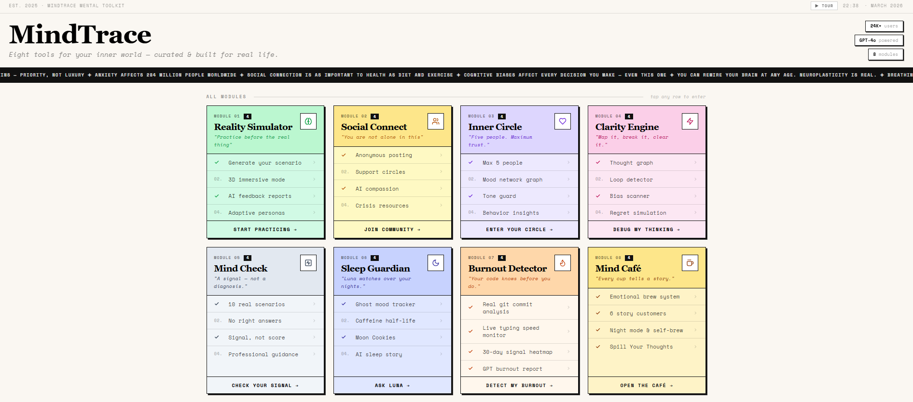
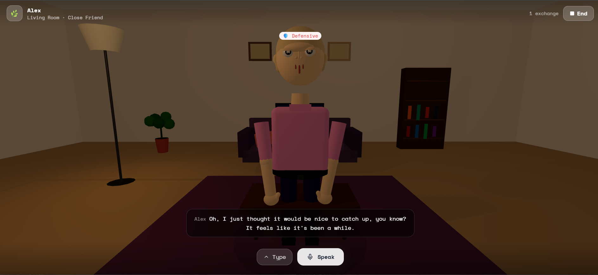
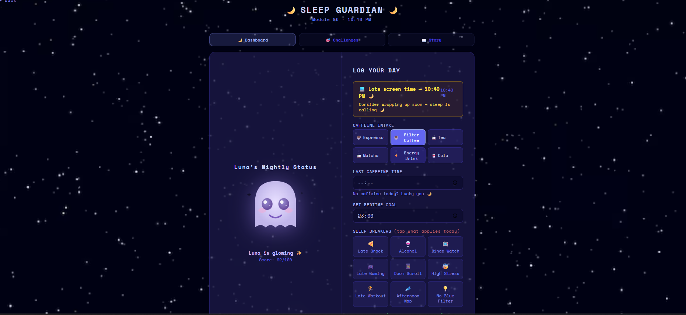

<!-- ═══════════════════════════════════════════════════════════════ -->
<!--                        MINDTRACE README                        -->
<!-- ═══════════════════════════════════════════════════════════════ -->

<div align="center">
  
  <br/><br/>

  <h1>🧠 MindTrace</h1>

  <p>
    <strong>Eight tools for your inner world.</strong><br/>
    <em>You track your commits, your deployments, your uptime.<br/>
    MindTrace asks one more question — how are <strong>you</strong> holding up?</em>
  </p>

  <p>
    <a href="https://mind-trace-ten.vercel.app">
      
    </a>
    &nbsp;
    <a href="https://mindtrace-8ob2.onrender.com/health">
      
    </a>
    &nbsp;
    
    &nbsp;
    
  </p>
</div>

---

## ✦ What is MindTrace?

MindTrace is a **developer-focused mental wellness platform** that combines behavioral data, AI analysis, and immersive interactive tools to help you understand your inner world — without judgement, without clinical jargon, and without leaving your browser.

> *Built for the people who build everything else.*

---

## 📸 Screenshots

<table>
  <tr>
    <td align="center" width="33%">
      
      <br/><sub><b>Main Hub — all eight tools</b></sub>
    </td>
    <td align="center" width="33%">
      
      <br/><sub><b>Reality Simulator — Immersive Room</b></sub>
    </td>
    <td align="center" width="33%">
      
      <br/><sub><b>Sleep Guardian — Luna + AI Stories</b></sub>
    </td>
  </tr>
</table>

---

## 🗂️ The Eight Modules

<table>
  <tr>
    <td>
      <h3>01 · 🌱 Reality Simulator</h3>
      <em>"Practice before the real thing"</em><br/>
      <blockquote>Reduces social anxiety by letting you rehearse difficult conversations in a safe, consequence-free environment.</blockquote>
      Simulate high-stakes conversations — a difficult chat with your manager, setting a boundary, navigating conflict — before they happen in real life.<br/><br/>
      ✅ AI-generated scenarios across 12 life contexts &nbsp;·&nbsp; ✅ GPT-powered coaching report<br/>
      🔜 3D immersive mode &nbsp;·&nbsp; 🔜 Adaptive AI personas
    </td>
    <td>
      <h3>02 · 🤝 Social Connect</h3>
      <em>"You are not alone in this"</em><br/>
      <blockquote>Combats isolation by giving you a space to be heard without fear of judgement or identity exposure.</blockquote>
      An anonymous, supportive community layer where you can post, read, and receive AI compassion responses.<br/><br/>
      ✅ Anonymous posting &nbsp;·&nbsp; ✅ AI compassion responses<br/>
      🔜 Support circles &nbsp;·&nbsp; 🔜 Crisis resources
    </td>
  </tr>
  <tr>
    <td>
      <h3>03 · 💜 Inner Circle</h3>
      <em>"Five people. Maximum trust."</em><br/>
      <blockquote>Strengthens your support system by deepening the quality — not quantity — of your key relationships.</blockquote>
      A private vault for your closest relationships — curated, protected, and behaviorally aware.<br/><br/>
      ✅ Max 5 person vault &nbsp;·&nbsp; ✅ AI tone guard<br/>
      🔜 Mood network graph &nbsp;·&nbsp; 🔜 Behavior insights
    </td>
    <td>
      <h3>04 · ⚡ Clarity Engine</h3>
      <em>"Map it, break it, clear it."</em><br/>
      <blockquote>Reduces cognitive overwhelm by externalising anxious thought loops and exposing the biases driving them.</blockquote>
      Visualise and debug your own thinking — loops, biases, and decision traps made visible.<br/><br/>
      ✅ Thought graph builder &nbsp;·&nbsp; ✅ Cognitive bias scanner<br/>
      🔜 Loop detector &nbsp;·&nbsp; 🔜 Regret simulation
    </td>
  </tr>
  <tr>
    <td>
      <h3>05 · 🔍 Mind Check</h3>
      <em>"A signal — not a diagnosis."</em><br/>
      <blockquote>Builds self-awareness early — catching subtle stress signals before they escalate into a crisis.</blockquote>
      A thoughtful mental health signal check via real-world scenario prompts. Not a quiz. Not a score. A mirror.<br/><br/>
      ✅ 10 scenario-based prompts &nbsp;·&nbsp; ✅ Signal result (not a score)<br/>
      🔜 Adaptive framework &nbsp;·&nbsp; 🔜 Professional guidance
    </td>
    <td>
      <h3>06 · 🌙 Sleep Guardian</h3>
      <em>"Luna watches over your nights."</em><br/>
      <blockquote>Improves sleep quality — the single highest-leverage intervention for mood, focus, and emotional regulation.</blockquote>
      Your nocturnal companion — tracks sleep signals and reads you a personalized AI story to help you drift off.<br/><br/>
      ✅ Ghost mood tracker &nbsp;·&nbsp; ✅ Moon Cookies ritual &nbsp;·&nbsp; ✅ GPT-4o sleep stories<br/>
      🔜 Caffeine half-life calculator
    </td>
  </tr>
  <tr>
    <td>
      <h3>07 · 🔥 Burnout Detector</h3>
      <em>"Your code knows before you do."</em><br/>
      <blockquote>Prevents burnout by surfacing behavioral warning signs weeks before they become physical or emotional collapse.</blockquote>
      Analyzes your <strong>real behavioral signals</strong> — not a questionnaire — to detect burnout before you feel it.<br/><br/>
      ✅ Live GitHub commit analysis (90 days) &nbsp;·&nbsp; ✅ Typing speed monitor<br/>
      ✅ Daily activity log &nbsp;·&nbsp; ✅ 30-day heatmap &nbsp;·&nbsp; ✅ GPT-4o burnout report
    </td>
    <td>
      <h3>08 · ☕ Mind Café</h3>
      <em>"Every cup tells a story."</em><br/>
      <blockquote>Makes emotional processing feel gentle and approachable by wrapping it in ritual, metaphor, and narrative.</blockquote>
      A cosy emotional processing space. Brew a drink that matches your mood. Listen to a stranger's story. Leave a thought on the wall.<br/><br/>
      ✅ Emotional brew system &nbsp;·&nbsp; ✅ 6 AI story customers<br/>
      ✅ Night mode & self-brew &nbsp;·&nbsp; ✅ Spill Your Thoughts wall
    </td>
  </tr>
</table>

---

## 🛠️ Tech Stack

| Layer | Technology |
|:---:|:---|
| **Frontend** | React 18 · Vite · TailwindCSS · Framer Motion |
| **Backend** | Node.js · Express (ESM) |
| **AI** | GPT-4o & GPT-4o-mini · OpenAI API |
| **Data** | GitHub REST API v3 |
| **Deployment** | Vercel (frontend) · Render (backend) |

---

## 🚀 Getting Started

### Prerequisites
- Node.js 18+
- OpenAI API key
- GitHub Personal Access Token *(for burnout git analysis)*

### Installation

```bash
git clone https://github.com/DikshaKhandelwal/MindTrace.git
cd MindTrace

cd simulator/frontend && npm install
cd ../backend && npm install
```

### Environment Variables

**`simulator/frontend/.env`**
```env
VITE_API_URL=       # empty for dev (Vite proxy handles it), set to Render URL in prod
VITE_OPENAI_KEY=    # OpenAI key for client-side features
```

**`simulator/backend/.env`**
```env
OPENAI_API_KEY=     # OpenAI key
ALLOWED_ORIGIN=     # your Vercel frontend URL (CORS)
GITHUB_TOKEN=       # GitHub PAT — public_repo scope (raises rate limit 60 → 5000 req/hr)
```

### Run Locally

```bash
# Terminal 1 — backend on :3001
cd simulator/backend && node server.js

# Terminal 2 — frontend on :5173
cd simulator/frontend && npm run dev
```

---

## ☁️ Deployment

| | |
|---|---|
| **Frontend → Vercel** | Push to `main` — Vercel auto-deploys. Set `VITE_API_URL=https://your-render-url.onrender.com` in Vercel env settings. |
| **Backend → Render** | Set `OPENAI_API_KEY`, `ALLOWED_ORIGIN`, and `GITHUB_TOKEN` in the Render dashboard environment tab. |

---

<div align="center">
  <br/>
  <p><em>"You track your commits, your deployments, your uptime.<br/>MindTrace asks one more question — how are <strong>you</strong> holding up?"</em></p>
  <br/>
  <sub>MIT © <a href="https://github.com/DikshaKhandelwal">Diksha Khandelwal</a></sub>
</div>
